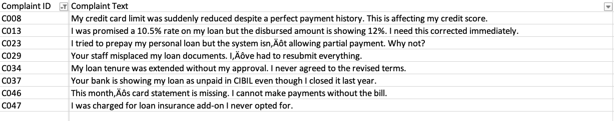
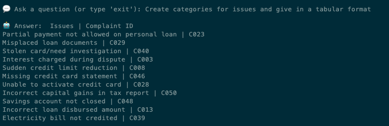

# Semantic Search RAG based model for Customer Complaints

## 👨‍💻 Author
Created By: Kshitij Patil (Tij)

## A quick overview:

This project is at initial stages and would require additional changes to make it production ready. This POC made using the langchain cookbook tries various optimization methods for RAG. It is being treated as sandbox to create and validate different optimization on Decomposition, Retrival, Routing and other opimization techinique. 

(Heavy influenced by LLM and langchain cookbook in addition to other sources)

 📢 Disclaimer

The customer complaints data utilized in this project is entirely fictional and has been generated solely for the purpose of demonstrating and testing the functionalities of this application. Any resemblance to actual persons, living or dead, or actual events is purely coincidental. This data should not be interpreted as real customer feedback or used for any real-world analysis.​

# 🧠 LLM-Based Topic Modeling for Customer Complaints

This project uses a Large Language Model (LLM) to perform topic modeling on customer complaints. It supports loading data from a **CSV file** or a **database**, and classifies each complaint into one or more predefined topics using OpenAI's GPT model with LangChain.

---

## 🚀 Features

- Semantic topic classification using GPT
- Supports both **CSV** and **Database (e.g. SQLite)** input
- Uses a **predefined topic list** from a `.txt` file
- Outputs topic-annotated CSV files
- Easily extensible with sentiment analysis or visualization

---

## 📁 Project Structure
Main Folder: /src
Customer Complaints: /data/customer/data
For RAG: /src/rag_model_file1
For RAG-fusion: /src/rag_model_fusion_file2.py
For sentiment analysis using LLM: src/sentiment_analysis.py
For topic modelling: src/topic_modelling.py
For Ingesting data from DB: src/sql_handling.py


## 📦 Input Files


### `customer_complaints.csv`

CSV file with a column named `Complaint Text`.

```csv
Complaint ID,Complaint Text
C001,"The ATM did not dispense cash but debited my account."
C002,"Overdraft fee charged despite sufficient balance."
```

## 📦 Some compartive results on the input and output data

### How does the data look like Raw compared to how the text is summarized based on the search context addtional context can be provided to have streamlined results based on the requirement of the solution




